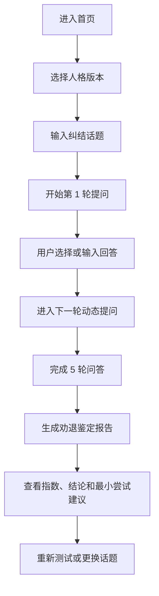

## 1. 产品概述
`劝退鉴定师` 是一个帮助用户在犹豫时快速理清思路的对话式网页 demo，通过 5 轮追问生成一份带有结论和行动建议的劝退鉴定报告。
- 目标是验证“先行动、再验证”的核心体验，服务于容易纠结、拖延、担心自己没准备好的年轻用户。
- MVP 聚焦纯前端演示，先用模拟 AI 逻辑验证对话节奏、人格差异和报告可用性。

## 2. 核心功能

### 2.1 用户角色
当前 demo 仅面向单一匿名访客角色，无登录注册流程。

| 角色 | 进入方式 | 核心权限 |
|------|----------|----------|
| 匿名用户 | 打开网页即用 | 输入话题、选择人格、完成问答、查看报告、重新开始 |

### 2.2 功能模块
1. **欢迎页**：展示一句话定位、产品气质、人格选择入口和话题输入框。
2. **问答页**：根据话题和人格逐轮展示 5 个问题，支持快捷选项和手动补充回答。
3. **报告页**：生成劝退指数、结论标签、分析摘要和最小尝试建议。

### 2.3 页面详情
| 页面名称 | 模块名称 | 功能描述 |
|-----------|-------------|---------------------|
| 欢迎页 | 品牌区 | 展示产品名、标语、温暖陪聊定位和“拒绝完美主义”的价值主张 |
| 欢迎页 | 人格切换 | 支持在“嘴毒版”和“委婉版”之间切换，实时反馈风格差异 |
| 欢迎页 | 话题输入 | 输入任意想尝试但犹豫的事情，支持示例话题快速代入 |
| 问答页 | 进度区 | 展示当前第几轮提问、总共 5 轮、当前人格和主题摘要 |
| 问答页 | 问题卡片 | 根据话题动态展示问题文案，围绕动机、条件、风险、替代方案、退路展开 |
| 问答页 | 快捷回答 | 提供 3 个预设选项，降低用户回答门槛 |
| 问答页 | 自定义输入 | 支持输入更具体的真实情况，增强报告个性化 |
| 问答页 | 实时提示 | 根据人格展示不同的陪聊反馈，如温柔鼓励或毒舌吐槽 |
| 报告页 | 劝退指数 | 以进度条和数字展示 0-100% 指数 |
| 报告页 | 结论标签 | 依据分档展示“勇敢去吧 / 建议先试水 / 建议再等等” |
| 报告页 | 具体分析 | 总结用户在 5 轮回答中的优势、阻碍和关键矛盾 |
| 报告页 | 最小尝试建议 | 永不为空，且必须是今天就能执行的一步 |
| 报告页 | 再来一次 | 支持重新开始或换一个话题 |

## 3. 核心流程
用户进入页面后先选择想要的 AI 人格，再输入一个纠结中的话题。系统进入 5 轮引导式问答，每轮都根据当前维度和已知回答生成更贴题的文案。完成第 5 轮后，系统计算劝退指数并输出一份带有行动建议的报告，最后用户可以重新开始下一轮测试。

## 4. 用户界面设计
### 4.1 设计风格
- 主色为深棕 `#8B5A2B`，辅助色为奶茶棕 `#D2B48C`，背景为奶油白 `#FFF8E7`
- 按钮采用大圆角、轻拟物阴影和柔和悬停反馈
- 中文字体使用系统中文字体栈，英文和数字采用圆润风格字体
- 布局以单页卡片式结构为主，桌面端居中展示，移动端纵向自适应
- 图形元素强调可爱、治愈、陪伴感；嘴毒版加入小恶魔细节，委婉版加入花朵和云朵细节

### 4.2 页面设计概览
| 页面名称 | 模块名称 | UI 元素 |
|-----------|-------------|-------------|
| 欢迎页 | 品牌区 | 大标题、手写感副标题、暖色渐变背景、悬浮贴纸元素 |
| 欢迎页 | 人格切换 | 双态胶囊按钮、图标提示、状态高亮和情绪文案 |
| 欢迎页 | 话题输入 | 大尺寸输入框、示例 chip、开始按钮、轻微动效 |
| 问答页 | 进度区 | 数字进度、线性进度条、当前维度提示、主题标签 |
| 问答页 | 对话卡片 | 角色头像、圆角气泡、差异化语气配色、层叠阴影 |
| 问答页 | 回答区 | 快捷选项按钮、自定义输入框、下一步按钮 |
| 报告页 | 结果卡片 | 大号指数、标签徽章、分析摘要、行动建议高亮模块 |
| 报告页 | 操作区 | 重新开始按钮、替换话题按钮、返回首页按钮 |

### 4.3 响应式策略
- 采用桌面优先设计，主视觉和卡片尺寸先按 1280px 以内布局设计
- 平板与移动端自动收窄卡片宽度、压缩间距并保持阅读层级清晰
- 交互控件保持足够点击面积，适配触屏场景

## 5. 验收标准
- 用户可以输入任意话题并顺利开始流程
- 用户可以随时切换嘴毒版和委婉版，且文案差异明显
- 问答流程固定为 5 轮，每轮问题都围绕不同维度展开
- 报告必须包含劝退指数、结论标签和最小尝试建议
- 最小尝试建议不能为空，且表述具体、当天可执行
- 界面风格符合棕色可爱系，整体圆润温暖
- 用户可以一键清空并回到初始状态
