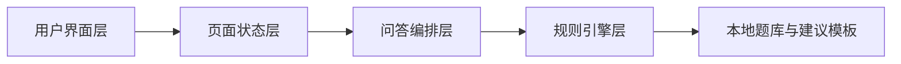
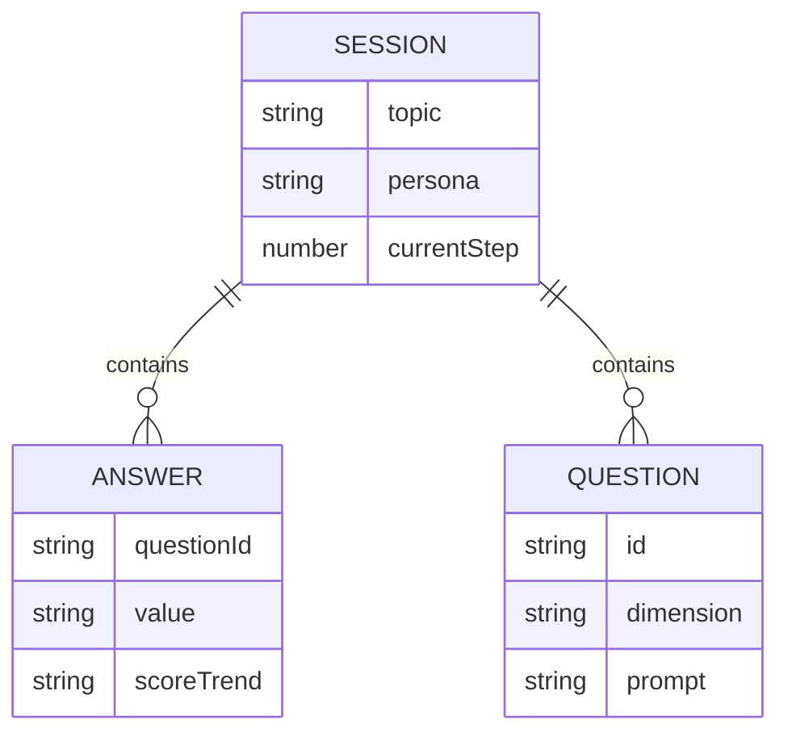

## 1. 架构设计
本 demo 采用纯前端架构，使用本地静态数据和规则引擎模拟 AI 问答与报告生成逻辑，不接入后端服务。



## 2. 技术说明
- 前端：React 18 + TypeScript + Vite
- 路由：`react-router-dom`
- 样式：Tailwind CSS 3
- 状态管理：Zustand
- 图标：`lucide-react`
- 测试：Vitest + Testing Library
- 初始化模板：`react-ts`

## 3. 路由定义
| 路由 | 用途 |
|-------|---------|
| `/` | 欢迎页，负责人格选择和话题输入 |
| `/session` | 5 轮问答页，展示动态问题和用户回答 |
| `/report` | 劝退鉴定报告页，展示结果和后续操作 |

## 4. API 定义
当前 demo 不包含后端 API。所有问答生成和结果计算均在浏览器内完成。

为保证后续易于接入真实模型，前端内部保留统一的数据接口类型：

```ts
export type PersonaType = 'sharp' | 'gentle'

export type TopicSessionInput = {
  topic: string
  persona: PersonaType
}

export type QuestionItem = {
  id: string
  dimension: 'motivation' | 'resource' | 'risk' | 'alternative' | 'fallback'
  prompt: string
  options: string[]
}

export type AnswerRecord = {
  questionId: string
  value: string
  scoreTrend: 'impulsive' | 'neutral' | 'rational'
}

export type ReportResult = {
  topic: string
  persona: PersonaType
  discourageScore: number
  verdict: 'go' | 'try-first' | 'wait'
  summary: string[]
  actionSuggestion: string
}
```

## 5. 服务端架构图
当前版本无服务端，不生成服务端架构图。

## 6. 数据模型
### 6.1 数据模型定义
本 demo 使用内存态数据模型管理会话：



### 6.2 数据定义说明
- `session`：保存当前话题、人格、问答进度和最终结果
- `questionBank`：按维度存储嘴毒版和委婉版的题目模板
- `answerScoringRules`：将用户回答映射到理性、冲动、中性倾向
- `actionSuggestionTemplates`：按常见话题方向生成兜底型“最小尝试建议”

## 7. 前端模块拆分
- `src/pages/HomePage.tsx`：欢迎页与话题输入
- `src/pages/SessionPage.tsx`：5 轮问答容器
- `src/pages/ReportPage.tsx`：报告页
- `src/components`：人格切换、问题卡片、回答区、指数卡、建议卡等复用组件
- `src/store/sessionStore.ts`：集中管理会话状态
- `src/utils/questionEngine.ts`：根据话题、人格和轮次生成问题
- `src/utils/reportEngine.ts`：根据回答计算指数、结论和摘要
- `src/utils/topicClassifier.ts`：将话题粗分到养宠、学习、职业、消费、兴趣等类别

## 8. 关键实现策略
- 问题生成：固定 5 个维度，结合话题分类和人格模板拼装问题文案
- 回答交互：每轮默认提供 3 个快捷选项，并保留手动补充输入
- 指数计算：5 轮回答按倾向累计分值，归一化到 0-100
- 结论映射：`0-39` 为“勇敢去吧”，`40-69` 为“建议先试水”，`70-100` 为“建议再等等”
- 行动建议：优先按话题分类匹配模板，匹配失败时退化为通用建议

## 9. 测试策略
- 组件测试：覆盖人格切换、问答进度、报告展示
- 逻辑测试：覆盖问题生成、评分计算、结论分档、兜底建议输出
- 页面验证：启动本地开发服务后进行浏览器端手工回归
