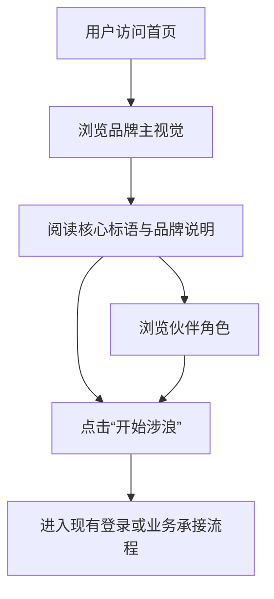

## 1. 产品概述
基于提供的“涉浪 Waveward”蓝白水彩视觉稿，重构现有前端首页，输出一个可直接作为品牌落地页和入口页使用的高质感首屏体验。
- 目标是把当前偏功能型页面改造成具备品牌感、记忆点和情绪氛围的视觉首页，同时保留后续接入业务流程的扩展空间。
- 面向首次访问用户、活动导流用户和品牌认知用户，突出“清透、治愈、轻盈、陪伴”的气质。

## 2. 核心功能

### 2.1 用户角色
本次首页重构不区分角色，统一面向访客展示。

### 2.2 功能模块
1. **首页**：品牌首屏、水彩背景、主文案、行动按钮、伙伴入口、波浪装饰。
2. **后续承接页入口**：保留进入现有登录流或体验流的跳转能力。

### 2.3 页面明细
| 页面名称 | 模块名称 | 功能说明 |
|-----------|-------------|---------------------|
| 首页 | 水彩背景氛围层 | 通过渐变、模糊、纹理和柔光模拟蓝白水彩纸面质感，形成品牌基底 |
| 首页 | 品牌识别区 | 展示品牌符号、中文“涉浪”和英文“Waveward”，建立视觉识别 |
| 首页 | 核心标语区 | 展示主标语“ 不等山海平，先踏一步浪 ”与辅助英文说明 |
| 首页 | 主行动按钮 | 提供“开始涉浪”主入口，点击后进入现有登录或主页流程 |
| 首页 | 伙伴导航区 | 以圆形头像卡形式展示多个伙伴角色，支持 hover 与选中反馈 |
| 首页 | 底部波浪区 | 以轻柔描边和半透明叠层波浪收束页面，增强空间纵深 |

## 3. 核心流程
用户进入首页后，先感知品牌氛围与主视觉，再通过主按钮进入主流程，或先浏览伙伴角色建立情感连接，随后进入体验。

## 4. 用户界面设计
### 4.1 设计风格
- 主色：雾蓝、海盐白、深海蓝
- 辅色：淡金米白、云灰蓝
- 按钮风格：高圆角胶囊按钮，带柔和高光、轻阴影和水彩肌理
- 字体建议：中文标题使用宋意气质或高对比衬线风格，英文品牌名使用优雅衬线；正文保持清晰易读
- 布局风格：单列纵向沉浸式首屏，元素居中，留白充足
- 图形风格：水滴、波浪、圆形角色徽章、纸张纹理、淡色晕染

### 4.2 页面设计概览
| 页面名称 | 模块名称 | UI 元素 |
|-----------|-------------|-------------|
| 首页 | 水彩背景氛围层 | 顶部和四周使用不规则蓝色晕染、渐隐纸面纹理、淡光晕 |
| 首页 | 品牌识别区 | 上方小型水滴波浪图标，中部中文大标题，下方英文副标题 |
| 首页 | 核心标语区 | 居中大字标语，浅色英文辅助说明，层次清晰 |
| 首页 | 主行动按钮 | 渐变蓝胶囊按钮、细腻阴影、hover 轻浮起 |
| 首页 | 伙伴导航区 | 6 个左右圆形角色头像，底部带角色名称，横向排列或移动端自适应换行 |
| 首页 | 底部波浪区 | 2 到 3 层线性波浪描边与柔和填充，呼应品牌主题 |

### 4.3 响应式
- 采用桌面优先设计，同时适配移动端。
- 移动端保持视觉稿的纵向沉浸排布，按钮和头像尺寸随视口缩放。
- 小屏设备上伙伴导航允许横向滚动，避免强行压缩。

### 4.4 动效建议
- 首屏元素分层淡入：背景先出现，品牌字标随后上浮，按钮最后入场。
- 背景水彩云层缓慢漂移，避免明显位移，保持安静感。
- 按钮 hover 时上浮 2px 并增强阴影。
- 伙伴头像 hover 时轻微放大，并显示柔和蓝色光晕。
