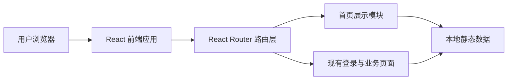
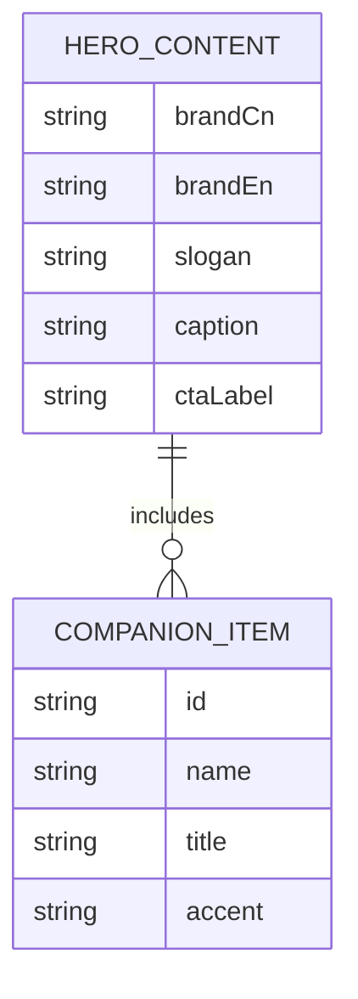

## 1. 架构设计


## 2. 技术描述
- 前端：React 18 + TypeScript + Vite + React Router
- 样式：Tailwind CSS 3 + 全局 CSS 变量 + 局部自定义动画
- 图标：`lucide-react`
- 状态管理：保留现有 `zustand` 登录状态逻辑
- 数据来源：首页角色与文案使用本地静态配置，不新增后端依赖

## 3. 路由定义
| 路由 | 用途 |
|-------|---------|
| / | 根据登录状态跳转 |
| /login | 展示重构后的“涉浪”品牌首页与入口页 |
| /home | 已登录后的现有主页 |
| /journey | 现有旅程页 |
| /session | 现有会话页 |
| /report | 现有报告页 |

## 4. API 定义
本次重构仅涉及静态首页展示，不新增后端 API。

### 4.1 前端数据类型
```ts
export type CompanionItem = {
  id: string
  name: string
  title?: string
  avatarPrompt?: string
  accent: string
}

export type HeroContent = {
  brandCn: string
  brandEn: string
  slogan: string
  caption: string
  ctaLabel: string
}
```

## 5. 服务端架构图
本次无需新增服务端逻辑。

## 6. 数据模型
### 6.1 数据模型定义


### 6.2 数据说明
- 首页静态数据放在 `src/data` 下，便于后续替换为真实业务配置。
- 页面组件按“页面容器 + 视觉区块 + 可复用展示组件”拆分，避免单文件过大。
- 全局样式新增颜色变量、阴影变量和水波动画变量，供首页复用。

## 7. 实现约束
- 尽量复用现有路由与登录跳转逻辑，避免影响已有业务页面。
- 首页视觉以 CSS 实现为主，不引入额外动画库。
- 如果没有可用角色插画资源，先使用高质量渐变头像占位或程序化插画风格圆章，避免出现低质量占位图。
- 所有新组件使用 `.tsx`，并控制在易维护的体量内。

## 8. 验证方案
- 运行 `npm run check` 确认 TypeScript 无报错。
- 运行 `npm run test:run` 验证已有测试不被破坏，并补充首页关键渲染测试。
- 启动本地预览，确认首屏排版、按钮状态、响应式和现有跳转逻辑可用。
